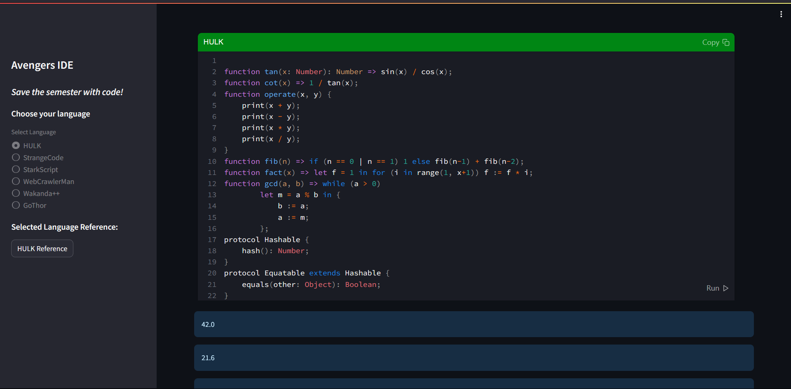

# HULK - Compilers Project 2024

[https://matcom.in/hulk/](https://matcom.in/hulk/)



> Compilers. Facultad de Matemática y Computación Universidad de La Habana. Curso 2024

## Execution

```bash
cd ./src
python -m streamlit run ./ide.py    # Run the IDE
```

### or go to [main.py](./src/main.py) and run it

## Dependencies

```bash
pip install streamlit
pip install streamlit_code_editor
```
